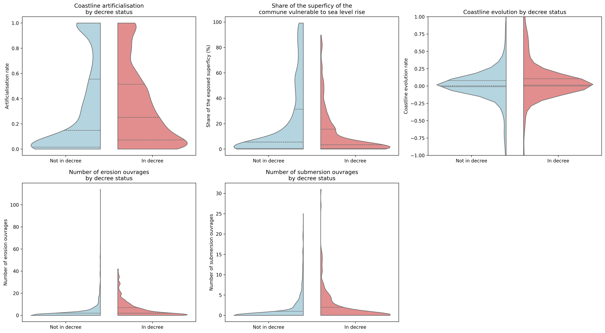

## Introduction 

L'érosion littorale est un phénomène causé par des actions humaines et naturelles.
Les principales causes de l'érosion littorale sont :

- l'action des vagues et des courants marins ;

- les marées et tempêtes ;

- l'élévation du niveau de la mer ;

- les aménagements côtiers (digues, ports, urbanisation) ;

- l'extraction de sable.

Le changement climatique a déjà causé une élévation du niveau de la mer de 20 cm depuis 1900 par le biais de la fonte des glaciers et de la dilatation thermique des océans.
Il est estimé que le niveau de la mer pourrait augmenter autour de 1 mètre d'ici 2100.

## Dispositifs réglementaires 

La France a progressivement mis en place des dispositifs réglementaires pour lutter contre l'érosion littorale.

- **Loi Littoral de 1996** : vise à protéger les espaces littoraux et à encadrer l'urbanisation.

- **Plan de Prévention des Risques Littoraux (PPRL)** : élaboré par les préfets, il identifie les zones à risque et impose des règles d'urbanisme.

- **Loi Climat et Résilience de 2021** : qui comporte des mesures telles que l'identification des communes exposées au recul du trait de côte par le [décret du 29 avril 2022](https://www.legifrance.gouv.fr/jorf/id/JORFTEXT000045685753).

## Problématique

L'inscription sur le décret se fait sur la base du **volontariat** des communes.
En 2024, 30% des communes littorales françaises "métropolitaines" étaient inscrites sur le décret.

L'inscription permet de recevoir des financements pour la création de cartes d'exposition à fine échelle pour des horizons temporels de 30 et 100 ans. En contrepartie, des restrictions d'urbanisme sont imposées, notamment l'interdiction de construire dans les zones identifiées comme à risque. Des outils juridiques comme un bail réel d'adaptation au recul du trait de côte ou des mesures pour faciliter la relocalisation des activités et des populations sont également prévus.

### Questions de recherche

1. Comment l’adaptation à l'érosion littorale et à la montée du niveau des mers est-elle envisagée dans les textes de loi ?  

2. Les territoires identifiés dans le décret Article L321-15 comprennent-ils bien tous les territoires à risque ?  

3. Y-a-t-il des différences socio-économiques (revenus, inégalités, population...) ou politiques entre les territoires à risque compris dans le décret ou pas ? 

4. Quelle approche législative alternative pourrait davantage prendre en compte les questions d’équité entre les communes ?   


## Description juridique du décret

### Origine juridique
Article 239 de la loi n° 2021-1104 du 22 août 2021 (loi "Climat et résilience") qui vise à renforcer l’adaptation des territoires face aux effets du changement climatique, notamment l’érosion côtière et la montée des eaux.

### Acteurs concernés
- État (Premier ministre, administration centrale)

- Conseil national de la mer et des littoraux (CNML)

- Comité national du trait de côte

- Communes littorales (maires, conseils municipaux)

- Services déconcentrés (DREAL, DDTM)

- Propriétaires fonciers, habitants et usagers du littoral

- Experts scientifiques (Cerema, BRGM, SHOM)

- Associations de protection de l’environnement

### Champ d’application de l’article L321-15 du code de l’environnement

- **Territorial :**

    - Liste de communes fixée par décret (décret 2024 à jour) révisée au moins tous les 9 ans, complétée en fonction des connaissances actualisées (indicateur national de l’érosion littorale - art. L.321-13 du code de l’urbanisme).

    - Prise en compte du risque (aléa + enjeux).

    - Procédure de mise à jour :

        1. Délibération favorable des conseils municipaux

        2. Avis du CNML et du comité du trait de côte

        3. Décision par décret du Premier ministre

- **Matériel :**

    - Intégration obligatoire dans les documents d’urbanisme :

        - Plans locaux d’urbanisme (PLU)

        - Cartes communales

        - Documents en tenant lieu

- **Implications juridiques (articles L121-22-1 à L121-22-12 du code de l’urbanisme) :**

    - Obligation de produire une carte locale d’exposition (si le PPRL n’intègre pas le recul du trait de côte)

    -  Les PPR littoraux pour le risque de submersion marine et les PPR multirisques adoptent une approche multi-aléa, à la différence des autres. La loi climat et résilience (2021) a acté le principe de déconnexion du phénomène d’érosion des PPR littoraux : l’érosion relève désormais de la compétence des collectivités qui doivent établirdes cartes et les intégrer aux PLU (via la recomposition spatiale notamment) ; le volet « érosion » des PPR littoraux va donc disparaître.

    - Possibilité de carte locale de projection (si le PPRL est adapté)

    - Restrictions possibles sur l’urbanisation future dans les zones à risque
<!-- 
- **Jeux de pouvoir :**

    - Tensions entre prérogatives de l’État et autonomie communale

    - Pressions foncières et immobilières locales

    - Acceptabilité sociale des restrictions d’usage du sol

    - Enjeux économiques et touristiques

- **Alternative juridique envisageable pour plus d’équité :**

    - Un dispositif volontaire et incitatif à l’échelle nationale :

        - Soutien financier et technique aux communes qui s’engagent

        - Mutualisation des risques ([fonds de solidarité littorale][https://www.banquedesterritoires.fr/erosion-cotiere-les-pistes-de-financement-du-rapport-interinspections-enfin-devoilees)

        - Adaptation progressive des règles selon les capacités locales et l’exposition réelle

        - Renforcement du portage intercommunal ou régional pour éviter des approches fragmentées
 -->


## Synthèse générale des articles de presse : 


### Méthodes :  

Sur la base de données Europresse, recherche croisée des articles de presse, dans toutes les archives disponibles, cumulant, dans leur texte, les expressions « communes volontaires » et « érosion ». Ces deux expressions faisaient écho au décret, qui évoque explicitement l’expression de « communes volontaires ». Après plusieurs recherches de mots-clé croisés, cette expression s’est avérée la plus pertinente pour répertorier les articles faisant référence et commentant le décret et ses conséquences.  

Si Europresse recense la majorité des quotidiens de la presse quotidienne régionale, plusieurs quotidiens majeurs en sont absents :  

- Corse-Matin 

- La Provence 

- Nice-Matin 

- Presse de la Manche 

La faiblesse des ressources mise en avant dans la synthèse ci-dessous sur les territoires du sud de la France ou du littoral de la Manche doit donc, pour l’heure être analysée avec précaution : si les communes sont moins engagées dans la démarche volontaire face au recul du trait de côte, le caractère incomplet de la base de données utilisé pour cette revue de presse invite à la prudence dans l’interprétation et nous conduira à questionner ces territoires par d’autres moyens (études de cas, archives municipales, etc)  

 

### Le cadre législatif et réglementaire. Les motivations des communes à rejoindre le dispositif 

Les motivations des communes à rejoindre le dispositif varient selon les territoires et les contextes. Pour finir, l'inscription sur la liste reste volontaire, ce qui crée une carte à géométrie variable de l’adaptation au trait de côte, marquée par des inégalités d’engagement, de moyens et de vulnérabilités 

Certaines communes peu exposées choisissent d’intégrer le dispositif par précaution, pour accéder aux outils techniques et financiers, ou en prévision d’enjeux futurs : 

- Perros-Guirec : peu exposée, elle anticipe d’éventuels besoins futurs [@letelegramme2023erosion].

- Bretagne (notamment) : les communes y sont très nombreuses à s’engager volontairement, ce qui témoigne d’une forte prise de conscience régionale [@letelegramme2023bretagne]. 

D'autres communes agissent en réponse à des événements récents ou des situations critiques : 

- Crozon : après des tempêtes ayant fragilisé une route essentielle, la commune passe à l’action[@letelegramme2023bretagne]. Même logique à Douarnenez[@letelegramme2023douarnenez] : pour la maire, « il est important nous poser en territoire volontaire face à ces risques », notant des chutes de pierres ou l’érosion de pans du sentier de randonnée littoral du GR34.  

- Plougrescant : régulièrement touchée par des tempêtes et la submersion de routes[@letelegramme2023douarnenez]. 

- Ploemeur (Lorient) : des élus évoquent des routes côtières déjà menacées[@ouestfrance2023ploemeur]. 

- Wissant ou Lacanau : où les phénomènes d’érosion ont déjà eu des effets très visibles [@sudouest2023littoral] [@lavoixdunord2024wissant]. 

 

### Les réticences et obstacles rencontrés 

Certaines collectivités refusent d’intégrer la liste, craignant une perte de marge de manœuvre : 

- Des communes jugent les contraintes urbanistiques trop fortes [@lemoniteur2023lutte] [@sudouest2023adaptation] et/ou les marges de manœuvre financières trop faibles [@afp2024brouillard] [@sudouest2023adaptation]

- Le manque d’intérêt perçu des dispositifs, face aux obligations engendrées, freine aussi l’engagement des collectivités [@sudouest2023refus]

 

Dans la région Méditerranéenne, la Cour des comptes dénonce une faible mobilisation, résultant d’une faible conscience des risques. Cela se traduit par la faiblesse des plans de prévention des risques mis en œuvre de manière effective, ou de nombreuses constructions en zones rouges encore autorisée [@lemonde2024adaptation]. 

Plusieurs maires évoquent un sentiment de solitude face aux exigences techniques et aux coûts associés : 

- Lacanau : report d’un projet de relocalisation par manque de moyens ; coût d’un projet de digue jugé démesuré, malgré, dans le cas de Lacanau l’inscription de la commune dans une démarche volontaire. 

- Wissant : solutions bricolées (sapins de Noël sur les dunes) en l’absence d’appuis plus conséquents[@sudouest2023littoral]. 

- Crainte de contentieux juridiques sur la décote des biens à racheter[@lemonde2024adaptation]. 

Enfin, certaines communes apparaissent, dans un second temps, résistantes : certaines se retirent des dispositifs après les avoir intégrés (ex. Marseillan, Vielle-Saint-Girons), faute de ressources ou par désaccord sur les effets du dispositif[@lemonde2024adaptation]. 

Le caractère volontaire de la démarche illustre l’hétérogénéité des positions des acteurs politiques sur les littoraux, qu’ils soient ou non exposés à l’érosion : Pour Michel Laborde, adjoint au maire de Biarritz, sa commune « a choisi de mener une lutte active en confortant ses falaises notamment, quand la commune voisine choisit de laisser davantage faire la nature »[@sudouest2023littoral]. Le président de l’association nationale des élus des littoraux ([ANEL](https://www.anel.asso.fr/adherents/)), -dont la représentation semble particulièrement marquée sur les territoires côtiers huppés- plaide pour une souplesse législative permettant de maximiser le libre arbitre des collectivités locales[@sudouest2023littoral].  

- Les maires redoutent enfin un "transfert de charges masqué de l'État vers les communes, sans les ressources financières dédiées, alors que l'impact financier de l'érosion du littoral est estimé à plusieurs dizaines de milliards d'euros".([Banque des territoires](https://www.banquedesterritoires.fr/recul-du-trait-de-cote-le-conseil-detat-rejette-un-recours-de-lanel-et-de-lamf))


## Approche quantitative

Dans un premier temps, nous allons analyser le territoire métropolitain mais nous pourrons étendre l'analyse à la France d'outre-mer.

### Carte interactive des communes littorales

```{python}
#| echo: false
#| warning: false
import pandas as pd
import numpy as np
import geopandas as gpd
import matplotlib.pyplot as plt
import matplotlib.colors as mcolors
import cartopy.crs as ccrs
import folium
import os
import seaborn as sns

communes_littorales = gpd.read_file("../data/communes_littorales/communes_littorales.shp")
communes_littorales['INSEE_COM'] = communes_littorales['INSEE_COM'].astype(str).str.zfill(5)
comm_decret_2022 = pd.read_csv("../data/communes_littorales/comm_decret_2022.txt", header=None).squeeze().tolist()
comm_decret_2022 = [str(x).zfill(5) for x in comm_decret_2022]  # Ensure all codes are 5 digits
comm_decret_2023 = pd.read_csv("../data/communes_littorales/comm_decret_2023.txt", header=None).squeeze().tolist()
comm_decret_2024 = pd.read_csv("../data/communes_littorales/comm_decret_2024.txt", header=None).squeeze().tolist()
comm_2022_not_2023 = communes_littorales[communes_littorales['INSEE_COM'].isin(set(comm_decret_2022) - set(comm_decret_2023))]
comm_2023_not_20224= communes_littorales[communes_littorales['INSEE_COM'].isin(set(comm_decret_2023) - set(comm_decret_2024))]
comm_off = pd.concat([comm_2022_not_2023, comm_2023_not_20224]).drop_duplicates()


communes_littorales["decret_2022"] = communes_littorales["INSEE_COM"].isin(comm_decret_2022)
communes_littorales["decret_2023"] = communes_littorales["INSEE_COM"].isin(comm_decret_2023)
communes_littorales["decret_2024"] = communes_littorales["INSEE_COM"].isin(comm_decret_2024)

c1 = '#ccff33'
c2 = '#70e000'
c3 = '#00b300'
c4 = '#d00000'
c5 = 'grey'

communes_littorales['color'] = np.where(communes_littorales['INSEE_COM'].isin(comm_off.INSEE_COM), c4,
    np.where(communes_littorales['INSEE_COM'].isin(comm_decret_2022), c1,
    np.where(communes_littorales['INSEE_COM'].isin(comm_decret_2023), c2,
             np.where(communes_littorales['INSEE_COM'].isin(comm_decret_2024), c3, c5))))# Create a folium map with different colors based on vulnerability and decree status
m = folium.Map(location=[46.5, 2], zoom_start=5, tiles='OpenStreetMap')

def style_function(feature):
    color = feature['properties']['color']
    return {
        'fillColor': color,
        'color': color,
        'weight': 1,
        'fillOpacity': 0.5
    }

def highlight_function(feature):
    return {
        'weight': 3,
        'color': '#666',
        'fillOpacity': 0.7
    }

# Add the GeoDataFrame to the map with the style function and popup showing the commune name
folium.GeoJson(
    communes_littorales,
    style_function=style_function,
    highlight_function=highlight_function,
    tooltip=folium.GeoJsonTooltip(fields=['NOM_COM'], aliases=['Commune:'])
).add_to(m)

# Add ADM1 (département) borders


#add a legend to explain what are the colors
# m.add_child(folium.LayerControl())
# Add a legend to the map
legend_html = f"""
<div style="position: fixed; 
    bottom: 50px; left: 50px; width: 270px; height: 140px; 
    background-color: white; z-index:9999; 
    font-size:14px; padding: 10px;">
    <b>Legend</b><br>
    <i style="display: inline-block; width: 14px; height: 14px; background: {c1}; margin-right: 5px; border:1px solid #888;"></i> In the decree since 2022<br>
    <i style="display: inline-block; width: 14px; height: 14px; background: {c2}; margin-right: 5px; border:1px solid #888;"></i> Joined in 2023<br>
    <i style="display: inline-block; width: 14px; height: 14px; background: {c3}; margin-right: 5px; border:1px solid #888;"></i> Joined in 2024<br>
    <i style="display: inline-block; width: 14px; height: 14px; background: {c4}; margin-right: 5px; border:1px solid #888;"></i> Once in the decree but left<br>
    <i style="display: inline-block; width: 14px; height: 14px; background: {c5}; margin-right: 5px; border:1px solid #888;"></i> Not in the decree<br>
</div>
"""

m.get_root().html.add_child(folium.Element(legend_html))

# Add a title to the map
title_html = """
<div style="position: fixed; 
    top: 10px; left: 50%; transform: translateX(-50%); 
    background-color: white; z-index:9999; 
    font-size:20px; text-align: center; font-weight: bold; 
    padding: 5px; box-shadow: 0px 4px 6px rgba(0, 0, 0, 0.1);">
    Communes littorales in the decree on coastal erosion
</div>
"""

m.get_root().html.add_child(folium.Element(title_html))

# Add a scale bar to the map
m.add_child(folium.LatLngPopup())

# Display the map
m
```

```{python}
#| echo: false
#| warning: false
communes_littorales['departement'] = communes_littorales['INSEE_COM'].str[:2]

com_dep = communes_littorales.groupby(['departement', 'color']).size().reset_index(name='count')
com_dep['share'] = com_dep['count'] / com_dep.groupby('departement')['count'].transform('sum')
# Keep only rows with color in [c1, c2, c3]
com_dep = com_dep[com_dep['color'].isin([c1, c2, c3])]
com_dep['total_in'] = com_dep.groupby('departement')['share'].transform('sum')
#order by total_in
com_dep = com_dep.sort_values(by='total_in', ascending=True)

fig, ax = plt.subplots(figsize=(10, 6))
# Get the unique colors present in the data, in the order of c1, c2, c3
color_order = ['#00b300', '#70e000', '#ccff33']
com_dep.loc[com_dep['color'] == c1, 'color'] = 'Joined in 2022'
com_dep.loc[com_dep['color'] == c2, 'color'] = 'Joined in 2023'
com_dep.loc[com_dep['color'] == c3, 'color'] = 'Joined in 2024'
com_dep = com_dep.rename(columns={'color': 'Year Joined'})

# Pivot and reindex to match the order in com_dep
departement_order = com_dep['departement'].unique()
com_dep_pivot = com_dep.pivot(index='departement', columns='Year Joined', values='share').reindex(departement_order)
com_dep_pivot.plot(
    kind='barh', stacked=True, ax=ax, color=color_order
)
ax.set_xlabel('Share of communes of the department in the decree')
ax.set_ylabel('Department')
```

## Analyse des données 



## Cat Nat data

```{python}
#| echo: false
#| warning: false

OUTPUT_DIR = "../../Data/CATNAT/csv_arretes"
df_catnat = pd.read_csv(os.path.join(OUTPUT_DIR, "merged_arretes.csv"), sep=';')
df_catnat = df_catnat[df_catnat['Nom du péril'].isin(["Chocs Mécaniques liés à l'action des Vagues"])]
df_catnat['Nom du péril'].value_counts()
df_catnat['N° Insee'] = df_catnat['N° Insee'].astype(str).str.zfill(5)

df_catnat = df_catnat[['N° Insee', 'Décision']].groupby(['N° Insee', 'Décision']).size().reset_index(name='count')
df_catnat.loc[df_catnat['Décision'].str.contains('Reconnue'), 'Décision'] = 'Reconnue'
df_catnat = df_catnat.groupby(['N° Insee', 'Décision']).sum().reset_index()
df_catnat = df_catnat.pivot(index='N° Insee', columns='Décision', values='count').reset_index()
df_catnat = df_catnat.fillna(0)
df_catnat['Non reconnue'] = df_catnat['Reconnue']/ (df_catnat['Reconnue'] + df_catnat['Non reconnue'])
df_catnat = df_catnat.rename(columns={'N° Insee': 'INSEE_COM', 'Non reconnue': 'taux'})

df_comm = communes_littorales.merge(df_catnat, on='INSEE_COM', how='left')
df_comm['taux'] = df_comm['taux'].fillna(0)
df_comm['Reconnue'] = df_comm['Reconnue'].fillna(0)

#two violin plots with the taux of non reconnue for communes in the decree and not in the decree

fig, ax = plt.subplots(1 , 2, figsize=(9,5))

sns.violinplot(
    x='decret_2024', y='Reconnue', data=df_comm, ax=ax[0],
    palette=['lightblue', 'lightcoral'], inner='quart', split=True, cut=0, bw=0.2
)
ax[0].set_title('Number of CatNat recognized by decree status')
ax[0].set_xlabel('')
ax[0].set_ylabel('Number of CatNat recognized')

sns.violinplot(
    x='decret_2024', y='taux', data=df_comm, ax=ax[1],
    palette=['lightblue', 'lightcoral'], inner='quart', split=True, cut=0, bw=0.2
)
ax[1].set_title('Rate of CatNat recognized by decree status')
ax[1].set_xlabel('')
ax[1].set_ylabel('Rate of CatNat recognized')

plt.tight_layout()
```	

## PPRL data

```{python}
#| echo: false
#| warning: false

OUTPUT_DIR = "../../Data/GASPAR/gaspar/pprn_gaspar.csv.csv"
df_pprl = pd.read_csv(OUTPUT_DIR, sep=';')
df_pprl = df_pprl[df_pprl['cod_ppr'].str.startswith('Plan de Prévention des Risques Naturels Littoral')]
df_pprl['cod_commune'] = df_pprl['cod_commune'].astype(str).str.zfill(5)
df_pprl_ero = df_pprl[df_pprl.lib_risque.isin(['Recul du trait de côte et de falaises'])]
df_pprl.cod_commune.nunique()
communes_littorales['pprl'] = communes_littorales['INSEE_COM'].isin(df_pprl['cod_commune'])
communes_littorales['pprl_ero'] = communes_littorales['INSEE_COM'].isin(df_pprl_ero['cod_commune'])
# Create a folium map centered at an average location
m = folium.Map(location=[47.0, 2.0], zoom_start=6, tiles='OpenStreetMap')
# Add the GeoDataFrame to the map with a style function
def style_function(feature):
    if feature['properties']['pprl_ero']:
        color = 'green'
    elif feature['properties']['pprl']:
        color = 'blue'
    else:
        color = 'red'
    return {
        'fillColor': color,
        'color': color,
        'weight': 1,
        'fillOpacity': 0.5
    }
folium.GeoJson(
    communes_littorales,
    style_function=style_function,
    tooltip=folium.GeoJsonTooltip(fields=['NOM_COM'], aliases=['Commune:'])
).add_to(m)
# Add a legend to the map
legend_html = """
<div style="position: fixed; 
    bottom: 50px; left: 50px; width: 270px; height: 90px; 
    background-color: white; z-index:9999; 
    font-size:14px; padding: 10px;">
    <b>Legend</b><br>
    <i style="display: inline-block; width: 14px; height: 14px; background: green; margin-right: 5px; border:1px solid #888;"></i> PPRL with erosion risk<br>
    <i style="display: inline-block; width: 14px; height: 14px; background: blue; margin-right: 5px; border:1px solid #888;"></i> PPRL (no erosion risk)<br>
    <i style="display: inline-block; width: 14px; height: 14px; background: red; margin-right: 5px; border:1px solid #888;"></i> No PPRL<br>
</div>
"""
m.get_root().html.add_child(folium.Element(legend_html))
# Add a title to the map
title_html = """
<div style="position: fixed; 
    top: 10px; left: 50%; transform: translateX(-50%); 
    background-color: white; z-index:9999; 
    font-size:20px; text-align: center; font-weight: bold; 
    padding: 5px; box-shadow: 0px 4px 6px rgba(0, 0, 0, 0.1);">
    PPRL in coastal communes
</div>
"""
m.get_root().html.add_child(folium.Element(title_html))
# Add a scale bar to the map
m.add_child(folium.LatLngPopup())
# Display the map
m
```

## EPCI data

```{python}	
#| echo: false
#| warning: false
#| label: EPCI

import matplotlib

epci_littorales = communes_littorales.copy()
epci_littorales = epci_littorales[['CODE_EPCI', 'geometry']]
epci_littorales = epci_littorales.dissolve(by='CODE_EPCI', as_index=False)
epci_littorales['decret_2024'] = epci_littorales['CODE_EPCI'].apply(lambda x: communes_littorales[communes_littorales['CODE_EPCI'] == x]['decret_2024'].mean())
epci_littorales['decret_2024'] = np.round(epci_littorales['decret_2024'], 2)  # Round to 2 decimal places

#make a folium map with the EPCI
m_epci = folium.Map(location=[46.5, 2], zoom_start=5, tiles='OpenStreetMap')
def style_function_epci(feature):
    # Use a gradient from light green (for 0) to dark green (for 1)
    value = feature['properties']['decret_2024']
    # Clamp value between 0 and 1
    value = max(0, min(1, value))
    # Use matplotlib colormap for green gradient
    color = matplotlib.colors.to_hex(matplotlib.cm.Greens(value))
    return {
        'fillColor': color,
        'color': color,
        'weight': 1,
        'fillOpacity': 0.7
    }

folium.GeoJson(
    epci_littorales,
    style_function=style_function_epci,
    tooltip=folium.GeoJsonTooltip(fields=['CODE_EPCI', 'decret_2024'], aliases=['EPCI:', 'Share in decree:'])
).add_to(m_epci)

#add title and legend to the map
title_html_epci = """
<div style="position: fixed; 
    top: 10px; left: 50%; transform: translateX(-50%); 
    background-color: white; z-index:9999; 
    font-size:20px; text-align: center; font-weight: bold; 
    padding: 5px; box-shadow: 0px 4px 6px rgba(0, 0, 0, 0.1);">
    Share of communes in the decree on coastal erosion by EPCI
</div>
"""

m_epci.get_root().html.add_child(folium.Element(title_html_epci))

m_epci
```

## Données socio-économiques

```{python}
#| echo: false
#| warning: false

rev = pd.read_csv('../data/FILO2021_DISP_COM.csv', sep=';')
year = '2021'
rev = rev[['CODGEO', f'NBMEN{str(year)[2:]}', f'NBPERS{str(year)[2:]}', f'NBUC{str(year)[2:]}',
                f'Q2{str(year)[2:]}', f'GI{str(year)[2:]}']]
rev.columns = ['CODGEO','Menages','Population','UC','Med_Niveau_vie','Gini']
rev['Year'] = str(year)

import seaborn as sns
comm_disp = communes_littorales.merge(rev, left_on='INSEE_COM', right_on='CODGEO', how='left')
fig, ax = plt.subplots(1, 3, figsize=(9,5))


#replace 's' by nan
comm_disp['Med_Niveau_vie'] = comm_disp['Med_Niveau_vie'].replace('s', np.nan)
comm_disp['Gini'] = comm_disp['Gini'].replace('s', np.nan)
# Replace 'nd' by NaN
comm_disp['Med_Niveau_vie'] = comm_disp['Med_Niveau_vie'].replace('nd', np.nan)
comm_disp['Gini'] = comm_disp['Gini'].replace('nd', np.nan)

comm_disp['Population'] = comm_disp['Population'].replace('s', np.nan)
comm_disp['Population'] = comm_disp['Population'].replace('nd', np.nan)

# Replace commas with dots in 'Med_Niveau_vie' and convert to float
comm_disp['Med_Niveau_vie'] = comm_disp['Med_Niveau_vie'].str.replace(',', '.').astype(float)
# Replace commas with dots in 'Gini' and convert to float
comm_disp['Gini'] = comm_disp['Gini'].str.replace(',', '.').astype(float)
# Replace commas with dots in 'Population' and convert to float
comm_disp['Population'] = comm_disp['Population'].str.replace(',', '.').astype(float)
comm_disp['Population'] = np.log(comm_disp['Population'])  # Log-transform the population for better visualization
# Replace commas with dots in 'Menages' and convert to float

sns.violinplot(x='decret_2024', y='Med_Niveau_vie', data=comm_disp, ax=ax[0], palette=['lightblue', 'lightcoral'])
ax[0].set_title('Median disposable income by commune')
#make horizontal lines for the medians fo each group
ax[0].axhline(y=comm_disp[comm_disp['decret_2024'] == 0]['Med_Niveau_vie'].median(), color='blue', linestyle='--', label='Median non-decret')
ax[0].axhline(y=comm_disp[comm_disp['decret_2024'] == 1]['Med_Niveau_vie'].median(), color='red', linestyle='--', label='Median decret')
ax[0].legend()

sns.violinplot(x='decret_2024', y='Gini', data=comm_disp, ax=ax[1], palette=['lightblue', 'lightcoral'])
ax[1].set_title('Gini index by commune')
#make horizontal lines for the medians fo each group
ax[1].axhline(y=comm_disp[comm_disp['decret_2024'] == 0]['Gini'].median(), color='blue', linestyle='--', label='Median non-decret')
ax[1].axhline(y=comm_disp[comm_disp['decret_2024'] == 1]['Gini'].median(), color='red', linestyle='--', label='Median decret')
ax[1].legend()

sns.violinplot(x='decret_2024', y='Population', data=comm_disp, ax=ax[2], palette=['lightblue', 'lightcoral'])
ax[2].set_ylabel('Log(Population)')
ax[2].set_title('Population by commune')
#make horizontal lines for the medians fo each group
ax[2].axhline(y=comm_disp[comm_disp['decret_2024'] == 0]['Population'].median(), color='blue', linestyle='--', label='Median non-decret')
ax[2].axhline(y=comm_disp[comm_disp['decret_2024'] == 1]['Population'].median(), color='red', linestyle='--', label='Median decret')
ax[2].legend()

#plt.tight_layout()
```


### Exposition des population

A partir des données carroyées à 200m de l'INSEE, nous allons calculer la part de la population exposée à la submersion marine (cad Plus Hautes Mers Astronomiques +1m).

```{python}	
#| echo: false
#| warning: false
#| label: exposition_population

exposure_df = pd.read_csv('../data/pop_mean_exposed_200m.csv')
exposure_df = exposure_df.rename(columns={'ind': 'pop_2019', 'ind_65_79': 'pop_65_79', 'ind_80p': 'pop_80p', 'ind_snv': 'nvm',
                                          'ind_exposed': 'pop_exposed', 'ind_65_79_exposed': 'pop_65_79_exposed',
                                          'ind_80p_exposed': 'pop_80p_exposed', 'ind_snv_exposed': 'nvm_exposed'})
communes_plot = communes_littorales.merge(exposure_df, on='INSEE_COM', how='left')
communes_plot['share_exposed'] = communes_plot['pop_exposed'] / communes_plot['pop_2019']
communes_plot.fillna(0, inplace=True)

#folium map of the share of the population exposed to coastal erosion by commune
m = folium.Map(location=[47.0, 2.0], zoom_start=6, tiles='OpenStreetMap')
def style_function_exposure(feature):
    taux = feature['properties']['share_exposed']
    if taux < 0.1:
        color = 'green'
    elif 0.1 <= taux < 0.2:
        color = 'yellow'
    elif 0.2 <= taux < 0.3:
        color = 'orange'
    else:  # taux >= 0.3
        color = 'red'
    return {
        'fillColor': color,
        'color': color,
        'weight': 1,
        'fillOpacity': 0.5
    }
folium.GeoJson(
    communes_plot,
    style_function=style_function_exposure,
    tooltip=folium.GeoJsonTooltip(fields=['NOM_COM', 'share_exposed'], aliases=['Commune:', 'Share of population exposed:'])
).add_to(m)
# Add a legend to the map
legend_html_exposure = """
<div style="position: fixed;
    bottom: 50px; left: 50px; width: 270px; height: 130px; 
    background-color: white; z-index:9999; 
    font-size:14px; padding: 10px;">
    <b>Legend</b><br>
    <i style="display: inline-block; width: 14px; height: 14px; background: green; margin-right: 5px; border:1px solid #888;"></i> Less than 10%<br>
    <i style="display: inline-block; width: 14px; height: 14px; background: yellow; margin-right: 5px; border:1px solid #888;"></i> Between 10% and 20%<br>
    <i style="display: inline-block; width: 14px; height: 14px; background: orange; margin-right: 5px; border:1px solid #888;"></i> Between 20% and 30%<br>
    <i style="display: inline-block; width: 14px; height: 14px; background: red; margin-right: 5px; border:1px solid #888;"></i> More than 30%<br>
</div>
"""
m.get_root().html.add_child(folium.Element(legend_html_exposure))
# Add a title to the map
title_html_exposure = """
<div style="position: fixed; 
    top: 10px; left: 50%; transform: translateX(-50%); 
    background-color: white; z-index:9999; 
    font-size:20px; text-align: center; font-weight: bold; 
    padding: 5px; box-shadow: 0px 4px 6px rgba(0, 0, 0, 0.1);">
    Share of population exposed to coastal erosion by commune
</div>
"""
m.get_root().html.add_child(folium.Element(title_html_exposure))
# Add a scale bar to the map
m.add_child(folium.LatLngPopup())
# Display the map

m
```	


Nous pouvons également visualiser le niveau de vie des personnes exposées relativement au niveau de vie moyen de la commune.

```{python}
#| echo: false
#| warning: false

communes_plot['relative_snv'] = (communes_plot['nvm_exposed'] - communes_plot['nvm'])/ communes_plot['nvm']
communes_plot.loc[communes_plot['relative_snv'] < -0.9, 'relative_snv'] = np.nan
communes_plot['relative_snv'] = communes_plot['relative_snv'].round(3)*100
communes_plot.loc[communes_plot['relative_snv'].isna(), 'relative_snv'] = np.nan
communes_plot.relative_snv

import cmocean as cmo 

cmap = cmo.cm.balance
#take 5 colors from the colormap
# colors = [cmap(i) for i in np.linspace(0, 1, 5)]
colors = ['#003049', '#669bbc', '#f0f3bd', '#ed553b', '#c72c41']
#folium map of the relative share of the population exposed to coastal erosion by commune
m_relative = folium.Map(location=[47.0, 2.0], zoom_start=6, tiles='OpenStreetMap')
def style_function_relative(feature):
    taux = feature['properties']['relative_snv']
    # Handle missing or nan values robustly
    if taux == -99:
        color = 'grey'
    elif taux is not None and isinstance(taux, (int, float)) and not np.isnan(taux) and taux < -20:
        color = colors[0]
    elif taux is not None and isinstance(taux, (int, float)) and not np.isnan(taux) and -20 <= taux < -5:
        color = colors[1]
    elif taux is not None and isinstance(taux, (int, float)) and not np.isnan(taux) and -5 <= taux < 5:
        color = colors[2]
    elif taux is not None and isinstance(taux, (int, float)) and not np.isnan(taux) and 5 <= taux < 20:
        color = colors[3]
    elif taux is not None and isinstance(taux, (int, float)) and not np.isnan(taux) and taux >= 20:
        color = colors[4]
    else:
        color = 'grey'
    return {
        'fillColor': color,
        'color': color,
        'weight': 1,
        'fillOpacity': 0.5
    }
folium.GeoJson(
    communes_plot,
    style_function=style_function_relative,
    tooltip=folium.GeoJsonTooltip(fields=['NOM_COM', 'relative_snv'], aliases=['Commune:', 'Relative share of population exposed:'])
).add_to(m_relative)
# Add a legend to the map
import matplotlib.colors as mcolors

# Convert RGBA tuples to hex strings for HTML
color_hex = [mcolors.to_hex(c) for c in colors]

legend_html_relative = f"""
<div style="position: fixed; 
    bottom: 50px; left: 50px; width: 320px; height: 150px; 
    background-color: white; z-index:9999; 
    font-size:14px; padding: 10px;">
    <b>Legend</b><br>
    <i style="display: inline-block; width: 14px; height: 14px; background: {color_hex[0]}; margin-right: 5px; border:1px solid #888;"></i> &lt; <-20% of average<br>
    <i style="display: inline-block; width: 14px; height: 14px; background: {color_hex[1]}; margin-right: 5px; border:1px solid #888;"></i> -20% to -5%<br>
    <i style="display: inline-block; width: 14px; height: 14px; background: {color_hex[2]}; margin-right: 5px; border:1px solid #888;"></i> -5% to 5%<br>
    <i style="display: inline-block; width: 14px; height: 14px; background: {color_hex[3]}; margin-right: 5px; border:1px solid #888;"></i> 5% to 20%<br>
    <i style="display: inline-block; width: 14px; height: 14px; background: {color_hex[4]}; margin-right: 5px; border:1px solid #888;"></i> &gt; >20% of average<br>
</div>
"""
m_relative.get_root().html.add_child(folium.Element(legend_html_relative))
# Add a title to the map
title_html_relative = """
<div style="position: fixed; 
    top: 10px; left: 50%; transform: translateX(-50%); 
    background-color: white; z-index:9999; 
    font-size:20px; text-align: center; font-weight: bold; 
    padding: 5px; box-shadow: 0px 4px 6px rgba(0, 0, 0, 0.1);">
    Niveau de vie of exposed buildings relative to the commune average by commune
</div>
"""
m_relative.get_root().html.add_child(folium.Element(title_html_relative))
# Add a scale bar to the map
m_relative.add_child(folium.LatLngPopup())
# Display the map
m_relative
```

Nous comparons également la part de personnes âgées de 65 ans exposées relativement à la part totale de la population exposée.

```{python}
#| echo: false
#| warning: false
#| label: exposition_population_age

communes_plot['relative_exposure_old'] = ((communes_plot['pop_80p_exposed'] + communes_plot['pop_65_79_exposed']) / (communes_plot['pop_80p'] + communes_plot['pop_65_79'])) * communes_plot['pop_2019']/ communes_plot['pop_exposed']
communes_plot['relative_exposure_old'] = communes_plot['relative_exposure_old']
communes_plot.loc[communes_plot['relative_exposure_old'].isna(), 'relative_exposure_old'] = np.nan

m = folium.Map(location=[47.0, 2.0], zoom_start=6, tiles='OpenStreetMap')
colors = ['#003049', '#669bbc', '#f0f3bd', '#ed553b', '#c72c41']
def style_function_relative_old(feature):
    taux = feature['properties']['relative_exposure_old']
    # Handle missing or nan values robustly
    if taux == -99:
        color = 'grey'
    elif taux is not None and isinstance(taux, (int, float)) and not np.isnan(taux) and taux < 0.5:
        color = colors[0]
    elif taux is not None and isinstance(taux, (int, float)) and not np.isnan(taux) and 0.5 <= taux < 0.75:
        color = colors[1]
    elif taux is not None and isinstance(taux, (int, float)) and not np.isnan(taux) and 0.75 <= taux < 1.25:
        color = colors[2]
    elif taux is not None and isinstance(taux, (int, float)) and not np.isnan(taux) and 1.25 <= taux < 1.5:
        color = colors[3]
    elif taux is not None and isinstance(taux, (int, float)) and not np.isnan(taux) and taux >= 1.5:
        color = colors[4]
    else:
        color = 'grey'
    return {
        'fillColor': color,
        'color': color,
        'weight': 1,
        'fillOpacity': 0.5
    }
folium.GeoJson(
    communes_plot,
    style_function=style_function_relative_old,
    tooltip=folium.GeoJsonTooltip(fields=['NOM_COM', 'relative_exposure_old'], aliases=['Commune:', 'Sur/sous exposition des personnes âgées:'])
).add_to(m)
# Add a legend to the map
legend_html_relative_old = f"""
<div style="position: fixed; 
    bottom: 50px; left: 50px; width: 320px; height: 150px; 
    background-color: white; z-index:9999; 
    font-size:14px; padding: 10px;">
    <b>Legend</b><br>
    <i style="display: inline-block; width: 14px; height: 14px; background: {colors[0]}; margin-right: 5px; border:1px solid #888;"></i> &lt; <50% of average<br>
    <i style="display: inline-block; width: 14px; height: 14px; background: {colors[1]}; margin-right: 5px; border:1px solid #888;"></i> 50% to 75%<br>
    <i style="display: inline-block; width: 14px; height: 14px; background: {colors[2]}; margin-right: 5px; border:1px solid #888;"></i> 75% to 125%<br>
    <i style="display: inline-block; width: 14px; height: 14px; background: {colors[3]}; margin-right: 5px; border:1px solid #888;"></i> 125% to 150%<br>
    <i style="display: inline-block; width: 14px; height: 14px; background: {colors[4]}; margin-right: 5px; border:1px solid #888;"></i> &gt; >150% of average<br>
</div>
"""
m.get_root().html.add_child(folium.Element(legend_html_relative_old))
# Add a title to the map
title_html_relative_old = """
<div style="position: fixed; 
    top: 10px; left: 50%; transform: translateX(-50%); 
    background-color: white; z-index:9999; 
    font-size:20px; text-align: center; font-weight: bold; 
    padding: 5px; box-shadow: 0px 4px 6px rgba(0, 0, 0, 0.1);">
    Sur/sous exposition des personnes âgées par commune
</div>
"""
m.get_root().html.add_child(folium.Element(title_html_relative_old))
# Add a scale bar to the map
m.add_child(folium.LatLngPopup())
# Display the map
m
```


